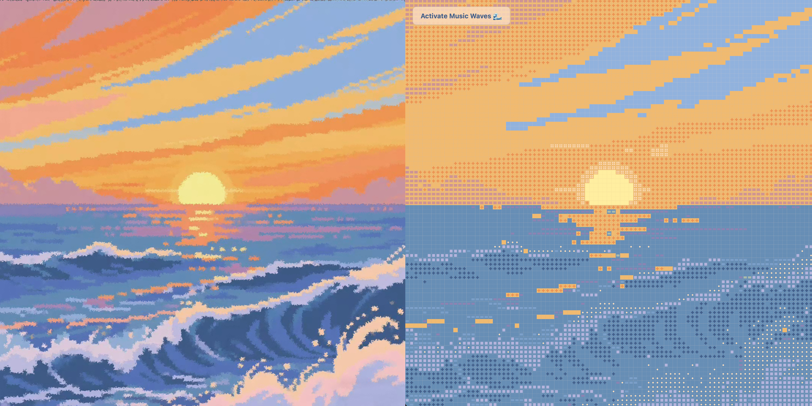
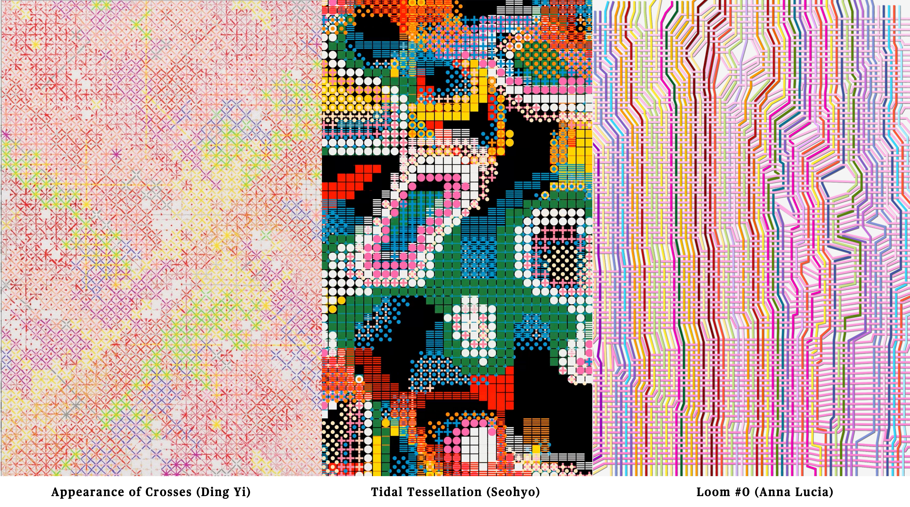
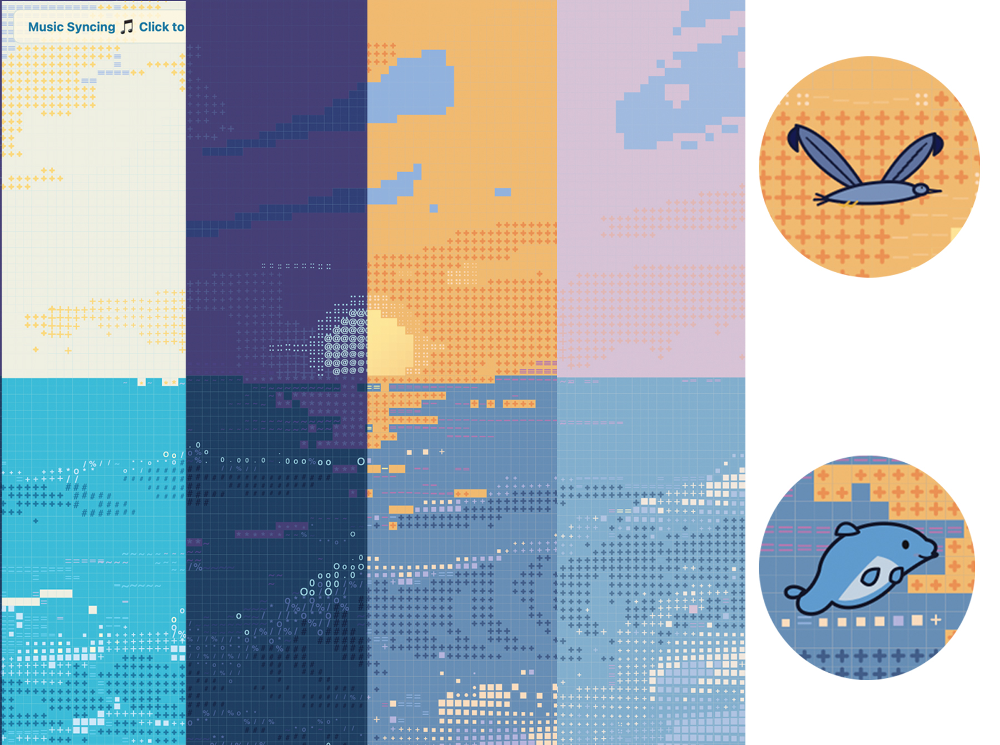
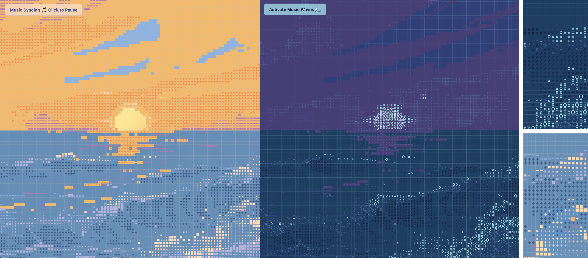
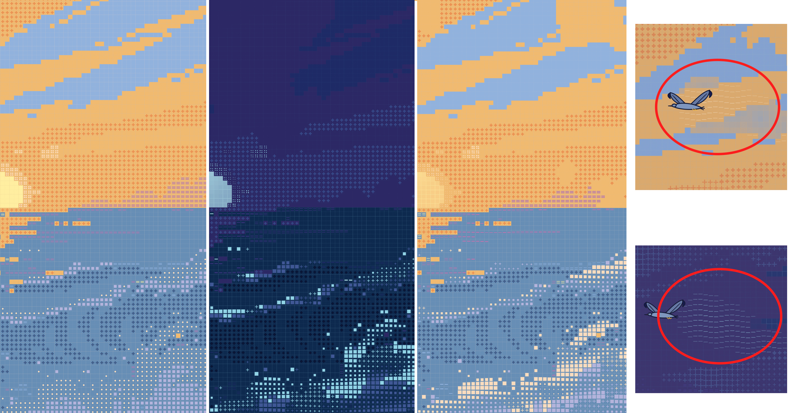
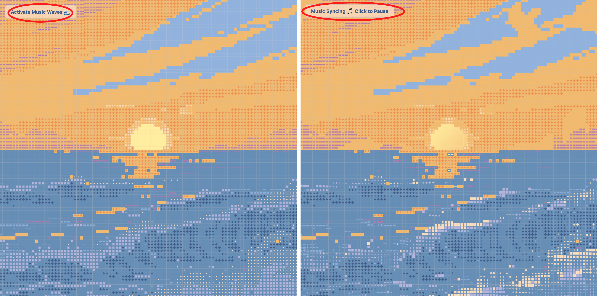
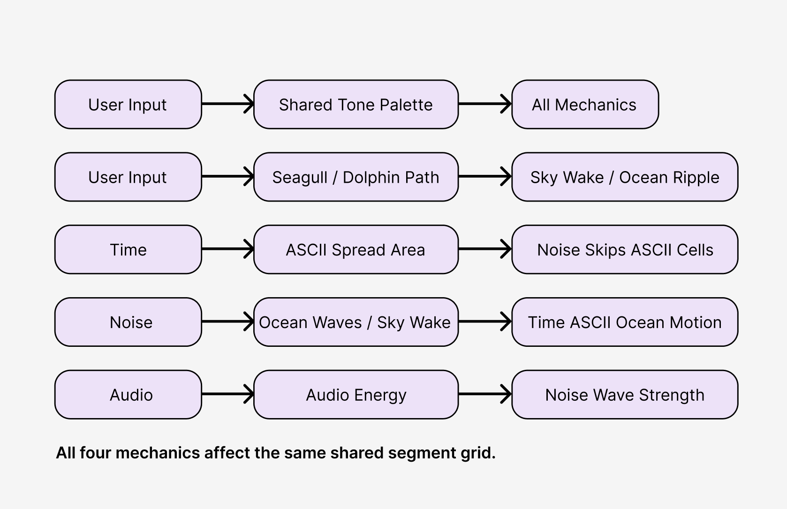

# Digital Tide

## Project Overview

Digital Tide is an interactive visual piece built with p5.js. We took a sunset image and broke it down into a segment grid — a grid of small cells, where each cell stores its position, size, colour, and colour name. Instead of showing the image as a normal picture, the artwork redraws it using repeated symbols: crosses, dots, lines, squares, colour blocks, and ASCII characters.

From a distance, the sunset silhouette is still recognisable. Up close, the image becomes a dense pattern of geometric marks and characters — somewhere between a landscape painting, a digital mosaic, and a woven textile.

This project reinterprets the repeated cross, grid, and symbol-based visual language of Ding Yi's *Appearance of Crosses*, rather than directly copying one specific image. We applied this visual language to a team-created sunset scene and extended it with interactive p5.js mechanics. As the piece runs, Perlin noise, time-based events, user input, and audio response all affect the same grid, turning the still sunset into something that moves, responds, and changes over time.

*Figure 1. The original sunset image translated into a segment grid of repeated colours, crosses, dots, lines, and geometric marks.*

## Inspiration

Our main artistic reference is **Ding Yi**'s *Appearance of Crosses*. His work uses repeated crosses, X-shapes, grid structures, and layered colours to build dense visual surfaces from a single simple mark. We borrowed this idea of "repetition, grid, and symbol" and turned it into our segment grid, where every cell can become a cross, dot, line, square, colour block, or character.

We also looked at **Seohyo**'s *Tidal Tessellation*, which showed us how geometric symbols can be used as basic units to reconstruct an image. This is why we did not display the sunset photo directly — we split it into grid cells and redrew it with different visual marks, keeping the overall shape while making it more abstract.

**Anna Lucia**'s *Loom #0* (2021) influenced our concept too. Its repeated lines reminded us of looms, threads, circuits, and data streams. This led us to think of Digital Tide as a kind of digital textile — an image woven from many small units, which can then be changed by time, sound, user input, and noise.

Together, these references shaped our direction. Ding Yi gave us the foundation of crosses, repetition, grid, and layered colour. Seohyo showed us how to reconstruct an image with geometric symbols. Anna Lucia inspired us to treat the grid as a system that can carry movement, rhythm, and interaction.

*Figure 2. Visual references used for the project, including Ding Yi's cross-based composition, Seohyo's grid/tessellation work, and Anna Lucia's line-based generative artwork.*

## Project Concept

The core idea of Digital Tide is to turn a still sunset image into a constantly changing digital textile. The artwork starts with a brief still moment, letting the viewer see the original image and its composition. After a short delay, the piece enters a dynamic state: ocean waves move through Perlin noise, the sky drifts with soft cloud changes, and the sun area gently pulses.

At the same time, the time mechanic spreads ASCII characters across the grid, the user input mechanic lets viewers change the colour tone and trigger seagull or dolphin paths, and the audio mechanic makes the waves respond to music energy.

The key design decision is that the four mechanics are not separate layers stacked on top of each other. They all work on the same segment grid. User input changes the colour mood, the time mechanic changes the symbol language, the noise mechanic adds natural movement, and the audio mechanic strengthens the wave rhythm. Because everything affects the same grid, the artwork stays unified — it feels like one interactive environment, not four separate effects.

## p5.js Techniques Used

The project uses image loading, colour sampling, arrays, functions, custom objects, and multiple JavaScript files. sketch.js handles image loading, responsive canvas creation, segment grid generation, and calls each mechanic file.

Main techniques:
- `noise()` — smooth, natural variation for waves, sky, and sun glow
- `random()` — random offset for the noise field so each session looks slightly different
- `map()` — converts noise values into position, size, and movement strength
- `sin()` — flickering, wave motion, and cyclical animation
- `frameCount` and timers — controls when the piece transitions between still, noise, and ASCII states
- `lerp()` — smooths out changes so nothing jumps suddenly
- `push()` and `pop()` — isolates drawing states between different shapes
- `windowResized()` — makes the artwork adapt when the browser window is resized
- Separate script files — each mechanic lives in its own file (noise.js, time-based.js, User-input.js, audio.js)

## Mechanic Ownership

### Xueqin — User Input Mechanic

**File:** User-input.js

This mechanic uses keyboard and mouse input to let viewers directly affect the artwork's colours, paths, and animations. Its main role is to turn viewer actions into visual changes, making the piece interactive rather than just an auto-playing animation.

**Colour control:** The mechanic uses different tone palettes to change the overall colour mood. Viewers can hold the left or right arrow keys to smoothly cycle between morning, noon, sunset, and night tones. This colour system is shared across all mechanics through `getPaletteColor()` and `applyToneToSegments()`, so the base image, noise effects, and ASCII characters all follow the same current tone.

**Mouse interaction:** When the viewer drags in the sky area, a seagull animation is triggered. When dragging in the ocean area, a dolphin animation appears. The area is detected using `mouseY` relative to the horizon line. This connects the viewer's gestures to natural elements within the scene.

*Figure 3.User input mechanic showing the four tone palettes (noon, night, sunset, morning from left to right) controlled by arrow keys, with close-ups of the seagull and dolphin animations triggered by mouse dragging.*

#### Development Process

The tone colour system was the starting point. Four colour palettes were set up for different time-of-day moods, so the same sunset image can shift between morning, noon, sunset, and night. The focus was on letting user input change the overall atmosphere, not just individual elements.

Mouse interaction came next. By detecting where the drag starts (sky or ocean), the system triggers either a seagull or dolphin animation. This gave user input a more concrete visual result beyond just colour changes.

The colour system was then designed as a shared palette, and path data was made accessible to other mechanics, so tone changes and mouse interaction can affect the whole artwork.

### Nicole — Time-Based Mechanic

**File:** time-based.js

This mechanic uses time control and frame-based events to spread ASCII characters across the segment grid in a rhythmic pattern. Its main role is to temporarily transform the image from geometric symbols into a text-based visual layer.

This connects directly to Ding Yi's repeated symbol language. Where Ding Yi builds density through repeated crosses and X-shapes, the time mechanic uses repeated ASCII characters as a new kind of visual mark. Characters do not appear randomly — they spread outward from the sun centre based on time and distance, creating a transition between landscape, geometric symbols, and characters.

The time mechanic also adds rhythm. The artwork does not stay in one state — it cycles between the noise-driven image and the ASCII layer, with the spread expanding outward and then reversing. This makes the piece feel like it has phases, and reinforces the digital textile concept because the characters are woven into the grid like new threads.

*Figure 4. The artwork in different states: sunset tone with noise movement (left), night tone (centre), and ASCII characters spreading across the grid (right).*

#### Development Process

The ASCII conversion system maps different grid regions to different characters — sky crosses become `+`, purple lines become `=`, ocean blue becomes `~`, and foam cycles through characters such as `o`, `*`, `%`, and `/`. This keeps the visual differences between sky, sun, and ocean rather than turning everything into random text.

The spread rhythm went through several rounds of adjustment. ASCII characters appear after a short delay (`startDelay`) and expand gradually from the sun centre using `dist()`, rather than covering everything at once. After filling the screen, the spread holds briefly before reversing, so the viewer has time to see each state clearly.

The spread speed is influenced by the noise wave (`sin(noiseTime)`), and the spread progress also drives `toneValue` forward, so the colour tone automatically shifts during ASCII expansion. Characters appear based on segment grid positions rather than as an independent overlay.

### Ying Li — Perlin Noise and Randomness Mechanic

**File:** noise.js

Ying Li was responsible for the Perlin noise and randomness mechanic, mainly developed in `noise.js`. This mechanic makes the originally still sunset grid feel more alive, while keeping the repeated, grid-based and symbolic visual language inspired by Ding Yi’s work. It mainly affects the ocean, sky and sun areas, turning the static sunset into a dynamic digital seascape.

In the ocean area, Perlin noise controls wave movement, reflection lines, foam cells and cross-shaped wave shadows. Different visual elements respond to noise in different ways: dark blue and golden orange cross cells move like wave shadows, sky blue, pink-purple and yellow line cells become shifting reflection lines, and foam-grey or cream-yellow cells morph between circles, squares, crosses and small dot clusters. Instead of random jumping, `noise()` creates smooth and continuous motion, so the ocean moves like rolling waves while still preserving the grid structure.

In the sky and sun areas, blue cloud cells softly appear and disappear with Perlin noise, while orange crosses and purple line cells shift slightly to create slow atmospheric movement. Around the sun, cream-yellow glow dots flicker and pulse, and the main sun area uses a subtle breathing effect. This makes the whole scene feel dynamic, not just the ocean.

The seagull path interaction is also an important part of this mechanic. When the user input mechanic triggers a seagull flying across the sky, the noise mechanic responds by changing the nearby sky cells along its path. These cells shift softly and briefly, creating a wake-like movement trace behind the bird. Instead of placing the seagull effect as a separate animation layer, this design makes the surrounding grid react to the bird’s movement, so the seagull feels connected to the sky environment.

*Figure 5. Noise mechanic in action across different tones (left to right), with close-ups of the soft sky wake left behind a seagull path (top right) and a dolphin in the wave region (bottom right).*

#### Development Process

The Perlin noise and randomness mechanic went through several rounds of testing and adjustment. At first, the focus was on the ocean. `noise()` was used to animate reflection lines, wave shadows and foam cells, making the still sea move with a gentle wave rhythm. The wave movement combines `sin()` and `noise()`: `sin()` creates a repeated wave rhythm, while Perlin noise adds smoother and less predictable variation. I also used `random(1000)` to create a random noise offset when the mechanic starts, so the noise field is not exactly the same every time the sketch runs.

The mechanic was then extended to the sky and sun. Blue cloud cells were given soft movement, orange cross cells gained subtle flow, and purple line cells shifted slightly across the sky. The sun glow dots were adjusted to create a gentle flickering effect without covering the main sun shape, while the sun body was given a subtle breathing movement.

Later, the noise mechanic was connected with the seagull path from the user input mechanic. When a seagull is triggered, nearby sky cells shift slightly, creating a natural movement trace instead of adding a separate layer. This helps the interaction feel part of the same grid environment.

Finally, the mechanic was integrated with the group system. It fades in after a short still image so the original artwork can be seen first, uses `getPaletteColor()` to follow user input tone changes, checks `isInTimeSpread()` to avoid visual overlap with the time-based ASCII mechanic, and connects with the audio mechanic through `getAudioWaveBoost()` so wave movement becomes stronger when music energy increases. Through these changes, the noise mechanic became a system that connects natural motion, colour changes, user interaction, time-based transformation and sound response within the same segment grid.

### Cayla — Audio Mechanic

**File:** audio.js

This mechanic uses music volume and frequency energy to influence the artwork, adding a sound-driven rhythm layer. When the viewer clicks the "Activate Music Waves" button, music starts playing and the audio mechanic analyses the sound energy, passing those values to the visual system.

Its main role is to connect the ocean visuals with sound. The system reads audio energy, bass, mid, and treble data using a Web Audio API analyser, and converts these into control values that other mechanics can use. When the music has more energy, the ocean waves move more intensely.

*Figure 6. Audio mechanic comparison: before activation (left) and after activation (right). When music is playing, the ocean waves move more actively in response to sound energy.*

#### Development Process

The playback system needed a user-triggered button because browsers block autoplay. This gives the viewer a clear entry point into the sound interaction.

The analyser reads frequency data and splits it into bass, mid, and treble ranges. The focus was not on just playing background music, but on turning sound into data that can drive visual changes.

Audio energy values are connected to the noise mechanic, so wave movement responds to music intensity. When music energy is high, `noiseSpeed` increases and the ocean moves more actively. When music is not playing, the waves return to their base movement.

## How the Four Mechanics Connect

The four mechanics are not four separate effects layered on top of each other. They all operate on the same `segmentArr` grid. Every cell stores its position, size, colour name, and current colour, so time, noise, user input, and audio are all changing the same visual structure.

**User input sets the shared colour system.** Viewers cycle through morning, noon, sunset, and night tones using arrow keys. This change is not local to user input — it syncs across the whole artwork through `getPaletteColor()` and `applyToneToSegments()`. Waves in the noise mechanic, ASCII characters in the time mechanic, and audio-boosted ocean movement all use the same current colours.

**Time and noise take turns.** The time mechanic spreads ASCII characters outward from the sun centre, transforming the symbol grid into a character layer. The noise mechanic checks `isInTimeSpread(segment)` and skips cells that are currently showing ASCII, so the two do not overlap. When the spread reverses, noise takes over those cells again. The spread progress also drives `toneValue`, so the colour tone shifts automatically during each expansion cycle.

**Noise responds to time characters.** Ocean ASCII characters are not static — they read wave data from the noise mechanic through `getWaveOffset()`, so characters like `~`, `#`, `%` bob up and down with the waves. This keeps the ASCII layer visually consistent with the ocean movement.

**User input feeds into noise.** When viewers drag in the sky, the seagull animation is created by user input, but the noise mechanic reads the seagull's path through `getSeagullWakeInfluence()` and softly shifts nearby sky cells, creating a natural trail effect. Dolphin animations appear in the ocean area, connecting with the wave region.

**Audio drives noise intensity.** When music is playing, the audio mechanic analyses sound energy and adjusts `noiseSpeed` in the noise mechanic. Louder music makes the waves move with more energy. The audio wave boost also affects foam morphing scale through `getAudioWaveBoost()`. When music is off, the waves return to their base speed.

The result: user input controls the global colour and triggers path events, time changes the grid's symbol state, noise handles natural movement and environmental response, and audio strengthens the wave rhythm. All changes come from the same segment grid, keeping the artwork unified.

*Figure 7. Mechanic connection diagram — each mechanic produces data that flows into the shared segment grid, keeping all four systems linked rather than layered separately.*

## Interaction Instructions

1. Open the project page.
2. Watch the brief still sunset image.
3. Wait for the piece to enter the Perlin noise dynamic state.
4. Click the "Activate Music Waves" button to start the music.
5. Hold the **left** or **right arrow key** to change the overall colour tone. The tone cycles smoothly between morning, noon, sunset, and night.
6. Drag in the **sky area** to trigger a seagull flight path.
7. Drag in the **ocean area** to trigger a dolphin jumping path.
8. Watch how time-based ASCII, noise movement, audio energy, and user input all affect the same grid system together.

The artwork is best viewed through one full cycle, as it transitions from still image to dynamic ocean, ASCII character layer, and sound-responsive visuals.

## File Structure

- `index.html` — loads p5.js, project scripts, and assets
- `sketch.js` — main file; handles image loading, responsive canvas, segment grid generation, and calls all mechanics
- `noise.js` — Perlin noise and randomness mechanic
- `time-based.js` — time-based ASCII mechanic
- `User-input.js` — user input mechanic; keyboard tone control, mouse drag paths, seagull and dolphin animations
- `audio.js` — audio mechanic; music playback, sound analysis, and audio energy control
- `assets/sunset.png` — the sunset base image used by the project
- `assets/Echoes of Nature - Low Tide.mp3` — the audio track used by the audio mechanic

## AI Acknowledgement

We used AI as an assistive tool during development, mainly to help explain logic, check JavaScript errors, organise function structure, and improve the clarity of our README and code comments.

AI did not replace our creative decisions. The theme, the reinterpretation of Ding Yi's work, the grid sunset visual direction, the four-mechanic division, animation rhythm, and final visual outcomes were all decided through group discussion, testing, and iteration.

AI was used for:
- Helping understand and organise p5.js code logic
- Checking JavaScript errors and resolving conflicts between mechanics
- Improving the structure of Perlin noise, ASCII spread, tone colour system, and audio response code
- Helping write clearer README text and code comments
- Explaining how certain AI-assisted code sections work

We also added AI acknowledgement comments in the relevant code sections, noting which parts used AI for explanation or debugging. All AI-assisted code was tested, modified, and integrated by the team before being included in the final version.

## External References

> Sources: [Appearance of Crosses (Ding Yi)](https://www.artsy.net/artwork/ding-yi-ding-yi-appearance-of-crosses-2) | [Tidal Tessellation (Seohyo)](https://www.lerandom.art/collection/tidal-tessellation-230328) | [Loom #0 (Anna Lucia)](https://www.artblocks.io/token/1/0xa7d8d9ef8d8ce8992df33d8b8cf4aebabd5bd270/213000000) | [p5.js Reference](https://p5js.org/reference/)

> Audio source: "Low Tide" from [Echoes of Nature: Ocean Waves (NetEase Cloud Music)](https://music.163.com/#/song?id=4054466). Used for educational coursework purposes only. The track's audio energy is analysed to influence ocean wave movement.

> Image source: sunset.png was created by our team as the base image for this project.

## Course Techniques

This project mainly uses techniques learned in class:
- Image loading and colour sampling
- Grid-based drawing
- Arrays and loops
- Functions and custom objects
- Responsive canvas resizing
- Perlin noise
- Random values
- Easing with `lerp()`
- Transformations: `translate()`, `rotate()`, `scale()`
- Keyboard and mouse interaction
- Frame-based animation
- Audio-driven visual response
- Modular code structure with separate script files

## Team Contribution Summary

Each member was responsible for one mechanic, with development contributions visible through GitHub commits.

- **Xueqin** — User input mechanic: colour switching, keyboard input, mouse paths, seagull and dolphin animations
- **Nicole** — Time-based mechanic: ASCII character conversion, spread rhythm, and time state control
- **Ying Li** — Perlin noise and randomness mechanic: ocean waves, sky, sun, foam, seagull trail, and noise transitions
- **Cayla** — Audio mechanic: music playback, sound analysis, and audio-driven wave feedback

The final project is integrated through the shared segment grid system in sketch.js.

