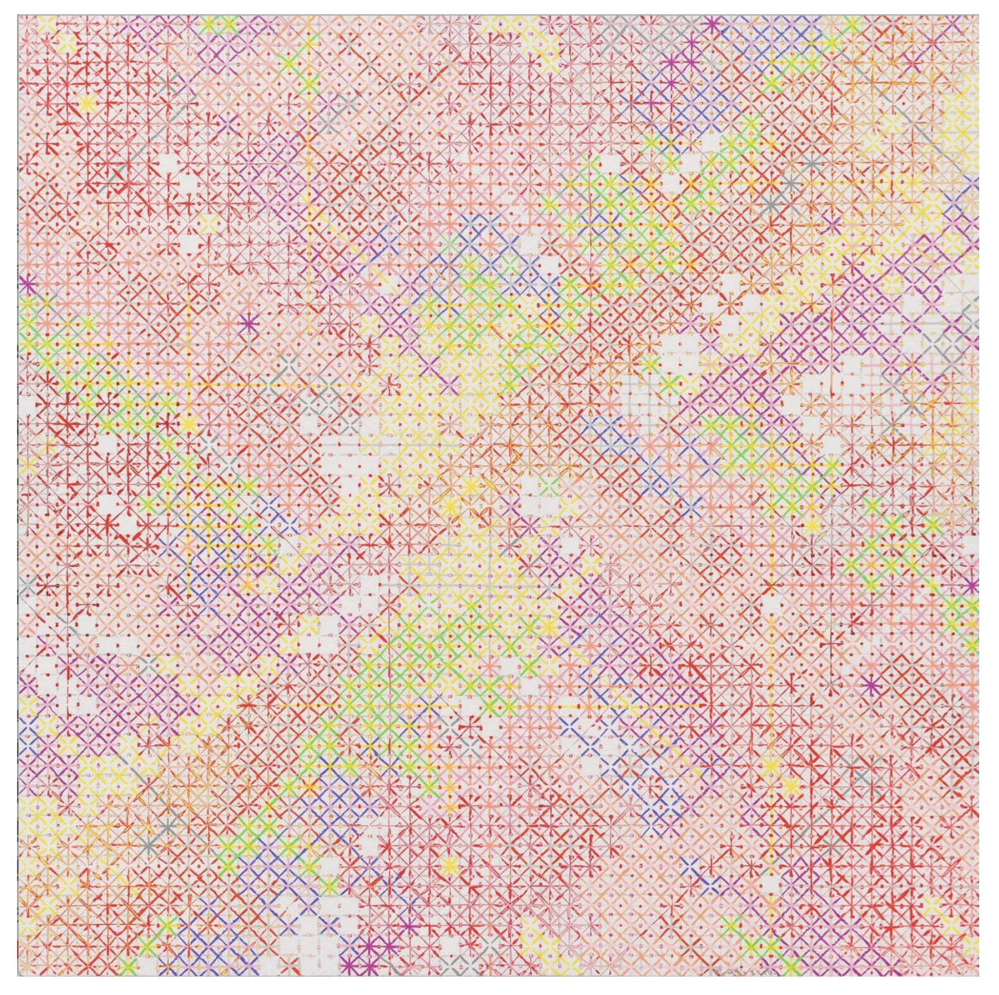
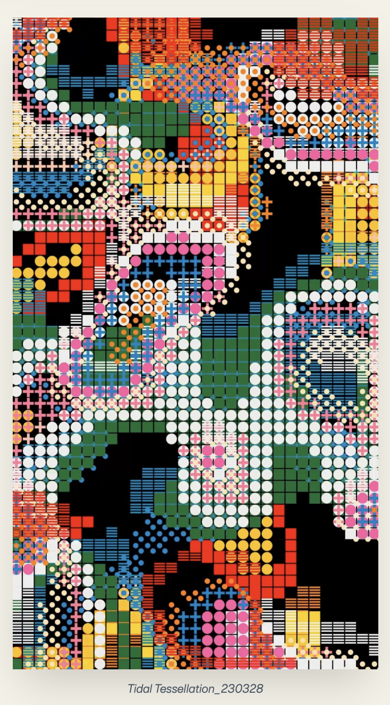
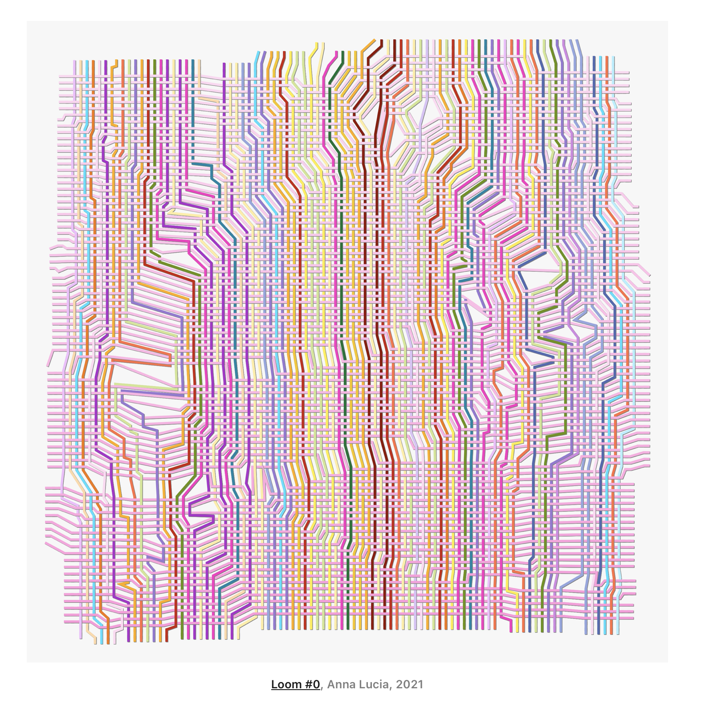
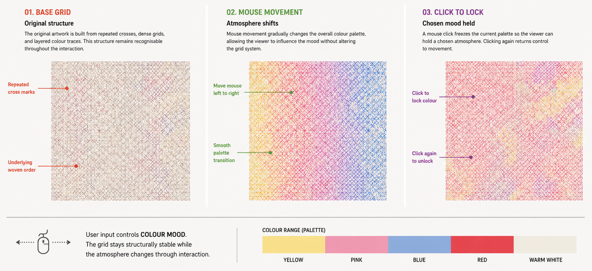
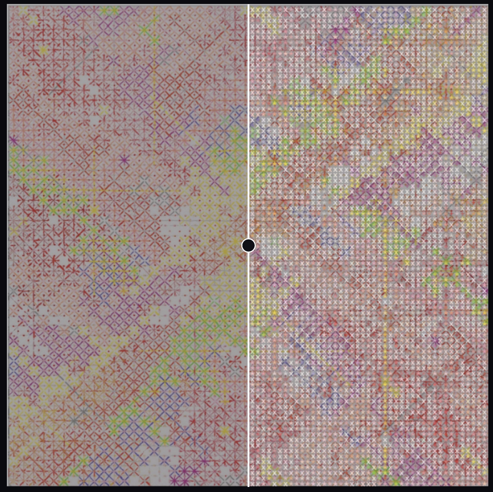
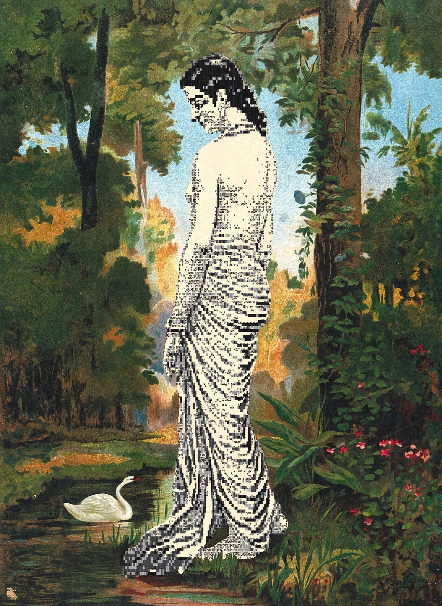
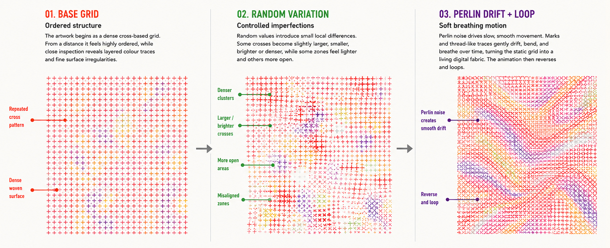

# Quiz 9: Final Assessment Project Pitch: Rewoven Crosses

## Part 1: Project Direction

Our team has chosen to reinterpret *Appearance of Crosses* by **Ding Yi**, a Chinese contemporary artist known for his grid-based paintings made from repeated cross and X motifs with layered colours. His works are built on a simple grid structure, but the overlapping colours make them feel dense and chaotic up close.

*Appearance of Crosses (Ding Yi) — the existing artwork our project is based on.*

We were inspired by **Seohyo**'s *Tidal Tessellation* for how it uses varied geometric symbols as building blocks in a grid to reconstruct an image. We want to bring this idea into our piece by incorporating shapes like circles, lines, and squares alongside Ding Yi's crosses. 

*Tidal Tessellation (Seohyo) — inspiration for using varied geometric symbols in a grid.*

We were also inspired by **Anna Lucia**'s *Loom #0* (2021), where repeated lines are organised like threads on a loom, electronic circuits, or data paths. This gave us the idea to develop Ding Yi's cross grid into a **digital textile** that changes based on **user input, time, randomness, and sound**.

*Loom #0 (Anna Lucia, 2021) — inspiration for the digital textile concept.*

We plan to take Ding Yi's core visual elements, such as crosses, repetition, density, and layered colour, and turn them into something that can move and change. 

> Sources: [Appearance of Crosses (Ding Yi)](https://www.artsy.net/artwork/ding-yi-ding-yi-appearance-of-crosses-2) | [Tidal Tessellation (Seohyo)](https://www.lerandom.art/collection/tidal-tessellation-230328) | [Loom #0 (Anna Lucia)](https://www.artblocks.io/token/1/0xa7d8d9ef8d8ce8992df33d8b8cf4aebabd5bd270/213000000)

## Part 2: Team Members and Mechanic Ownership
### Mechanic 1: User Input: Xueqin Zhao
The user input mechanic allows the viewer to control the overall **colour mood** of the grid through **mouse movement**. When the viewer moves the mouse from left to right across the canvas, the main colour palette of the grid gradually shifts between colours inspired by Ding Yi’s artwork, such as **yellow, pink, blue, red and warm white**. The colour transition will be smooth rather than sudden, so the image feels like a moving digital textile rather than a simple colour switch.
The viewer can also **click the mouse** to **lock the current colour palette**. When the colour is locked, mouse movement will no longer change the colours. Clicking again will **unlock the palette** and return control to the viewer. This keeps the interaction simple and easy to understand.
This mechanic connects to our project vision because Ding Yi’s work is built from repeated cross marks, dense grids and layered colour systems. My mechanic does not change the structure of the grid. Instead, it allows the viewer to influence the atmosphere of the artwork while keeping the repeated cross-based system recognisable.

*User input mechanic — mouse movement shifts colour mood, click to lock palette.*

### Mechanic 2: Time-based: Nicole Zheng
For my time-based mechanic, I want to create an animation that transforms the group's artwork into **text characters** over time.

Depending on how our group interprets the chosen artwork, this could take two forms. If the base image uses varied geometric symbols, I would create a **"flip card" wave effect**. A wave would sweep across the grid, and each cell would flip like a card to reveal a matching text character on the other side (for example, ○ → O, + → +, □ → #). I plan to achieve the flip effect by using `cos()` to scale each cell horizontally. As the cell squishes to zero width, the content switches from shape to character, then expands back to show the new face. By offsetting the timing based on each cell's position and `frameCount`, the flips should ripple across the canvas rather than happening all at once.

*Flip card concept — geometric crosses transformed into text characters with colours preserved.*

If the base artwork is more uniform (for example, a repeated cross pattern), I would try a **cracking effect** instead. Cracks would slowly appear on the surface and widen over time, revealing scrambled characters (random letters, numbers, and symbols) underneath the orderly grid.

*Cracking concept reference — characters used as visual texture (Enigmatriz).*

In both cases, the original colours would stay the same throughout, so the image remains recognisable even after the transformation. Once the animation finishes, it would reverse and loop back to the original artwork.

I'm not entirely sure how complex this will be to implement, but some of the core concepts have been covered in class (`cos()`, `scale()`, `frameCount`), and the rest (`push()`/`pop()`) are covered in p5.js tutorials I've been researching. 

> Image sources: Flip card sketch generated using [ASCII Lab](https://ascii-lab.sg.agentos-app.run) | Cracking concept reference from [Enigmatriz](https://enigmatriz.com/artworks/ascii-art)

### Mechanic 3: Perlin Noise and Randomness: Ying Li
The **Perlin noise and randomness mechanic** will make the cross-based grid feel less fixed and more like a **living digital textile**. Ding Yi’s artwork appears highly ordered from a distance, but when viewed closely, the repeated cross marks create a dense and slightly irregular surface. I want to translate this quality into code by using **random values and Perlin noise** to create **controlled imperfections** inside the grid.
The **random part** will decide which cells receive small variations. For example, some crosses may become slightly larger, smaller, brighter or denser than others. Some areas may contain more marks, while other areas may feel more open. These changes will not completely break the grid. Instead, they will create small interruptions, similar to **uneven stitches, woven threads or handmade variations** within a repeated pattern.
The **Perlin noise part** will control slow and smooth movement. Instead of making the cells jump randomly, selected marks or thread-like lines will gently **drift, bend or breathe over time**. This mechanic connects to our project because it turns Ding Yi’s static cross structure into a more **organic digital fabric**, where **order and randomness exist together**.

*Perlin noise mechanic — ordered grid → random variation → smooth breathing motion.*

### Mechanic 4: Audio: Cayla Wang
The audio mechanic transforms the grid into a **rhythmic, elastic loom** that responds to music in real time, shifting the focus from organic drift to **structural tension**. While the Perlin noise creates subtle, random imperfections, my mechanic uses `p5.FFT` to drive macro-level movements that follow the music’s energy.

The **bass** frequencies control the **"Global Elasticity"** of the grid: on every heavy beat, the entire grid will "pinch" toward the center or expand outward before snapping back, making the digital textile feel like it’s gasping or pulsing in sync with the rhythm. The **mid-range** frequencies handle **"Shearing and Alignment"**: instead of random drifting, the mid-tones will cause even and odd rows of crosses to slide horizontally in opposite directions, mimicking the mechanical shifting of threads on a loom. Finally, the **treble** frequencies trigger **"Signal Flashes"**: high-pitched sounds will cause individual crosses to flicker or change stroke weight instantly, adding a sharp, digital "glitch" texture that contrasts with the smooth movements elsewhere.

*Bass controls grid elasticity, mids shift rows like a loom, treble triggers signal flashes.*

This mechanic connects to our project by turning Ding Yi’s static system into a **reactive instrument**, where the ordered grid is no longer just a surface, but a physical structure that vibrates, stretches, and reacts to the pulse of the sound.

## Part 3: Putting It Together

Our project is like **weaving a "breathing" digital textile** on a shared canvas.

The **grid of crosses** is our foundation. **Xueqin** acts as the weaver, letting the user slide the mouse to change the color mood smoothly. **Ying Li** breathes life into the threads, using Perlin noise to make the surface pulse and drift like a living fabric. **Cayla** transforms the grid into a rhythmic, elastic loom. Finally, **Nicole** uses time to transform the texture, flipping the shapes like cards to reveal hidden layers of code.

By **sharing the same grid system**, our mechanics layer on top of each other, turning a static painting into a **responsive, evolving, and multisensory experience**.
