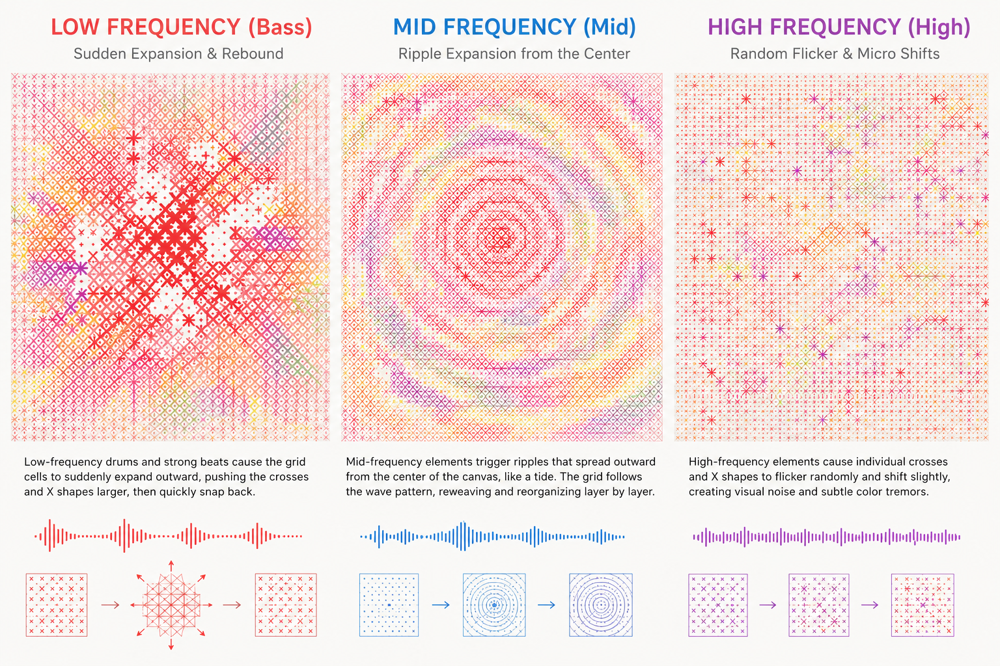

# Final_Project_Group3

# Part 1: Project Direction

Our team has chosen to reinterpret *Appearance of Crosses* by 
:contentReference[oaicite:0]{index=0}, 
a Chinese contemporary artist known for his grid-based paintings made from repeated cross and X motifs with layered colours. His works are built on a simple grid structure, but the overlapping colours make them feel dense and chaotic up close.

We were inspired by *Tidal Tessellation* by 
:contentReference[oaicite:1]{index=1} 
for how it uses varied geometric symbols as building blocks in a grid to reconstruct an image, like a mosaic made of circles, crosses, and lines instead of uniform tiles.

We were also inspired by *Loom #138* by 
:contentReference[oaicite:2]{index=2}. 
It uses short coloured dashes woven into a grid to create a textile-like pattern.

We plan to take Ding Yi's core visual elements — such as crosses, repetition, density, and layered colour — and turn them into something that can move and change.

---

## References

1. *Appearance of Crosses* — Ding Yi  
   [Artsy Artwork Page](https://www.artsy.net/artwork/ding-yi-ding-yi-appearance-of-crosses-2?utm_source=chatgpt.com)

2. *Tidal Tessellation* — Seohyo  
   [Le Random Collection Page](https://www.lerandom.art/collection/tidal-tessellation-230328?utm_source=chatgpt.com)

3. *Loom #138* — Anna Lucia  
   [Art Blocks Token Page](https://www.artblocks.io/token/1/0xa7d8d9ef8d8ce8992df33d8b8cf4aebabd5bd270/213000138?utm_source=chatgpt.com)

   ## Part 2: Mechanics

### Team Members and Mechanic Ownership

- **Xueqin Zhao** — User Input  
- **Nicole Zheng** — Time-based Mechanics  
- **Ying Li** — Perlin Noise and Randomness  
- **Cayla Wang** — Audio

### Mechanic 4: Audio

For my audio mechanic, I want to make the grid respond to music in a way that feels physical, as if the cross-based surface is vibrating or being pulled by the sound. The viewer loads a music file into the sketch, and the grid reacts to it in real time. I will use p5.FFT to split the audio into three frequency bands — bass, mid, and treble — and each one will drive a different kind of movement in the grid.

The bass part would control the biggest, most sudden changes. When a heavy beat hits, the grid cells expand outward and then snap back into place. This creates a pulse across the whole canvas, like the woven surface being struck and briefly losing its structure before returning to order. This connects to Ding Yi's idea of a rigid system that still carries tension beneath the surface.

The mid frequencies would create a slower, spreading ripple that moves outward from the centre of the grid. Instead of the whole canvas reacting at once, the change travels across the cells gradually, similar to how a single thread pulled in a woven fabric causes a wave of movement across the surrounding area.

The high frequencies would affect individual cells in a smaller and more scattered way, causing certain crosses or X marks to flicker, shift slightly, or brighten for a moment. This mirrors the visual noise that appears in Ding Yi's work when viewed up close, where small irregularities exist within an otherwise controlled pattern.

When the music is dense and loud, the grid is constantly moving and unstable. When the music quiets down, the surface settles back into stillness. I hope this mechanic can show how sound and structure can interact, where the ordered grid becomes something reactive and alive depending on what is playing.

