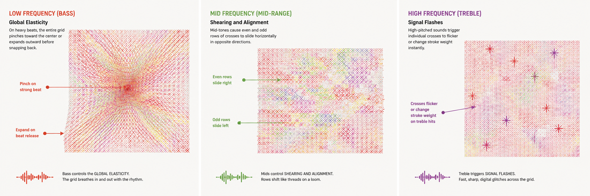

# Final_Project_Group3

## Part 1: Project Direction

Our team has chosen to reinterpret *Appearance of Crosses* by 
:contentReference[oaicite:0]{index=0}, 
a Chinese contemporary artist known for his grid-based paintings made from repeated cross and X motifs with layered colours. His works are built on a simple grid structure, but the overlapping colours make them feel dense and chaotic up close.

We were inspired by *Tidal Tessellation* by 
:contentReference[oaicite:1]{index=1} 
for how it uses varied geometric symbols as building blocks in a grid to reconstruct an image, like a mosaic made of circles, crosses, and lines instead of uniform tiles.

We were also inspired by *Loom #138* by 
:contentReference[oaicite:2]{index=2}. 
It uses short coloured dashes woven into a grid to create a textile-like pattern.

We plan to take Ding Yi's core visual elements — such as crosses, repetition, density, and layered colour — and turn them into something that can move and change.

---

 References

1. *Appearance of Crosses* — Ding Yi  
   [Artsy Artwork Page](https://www.artsy.net/artwork/ding-yi-ding-yi-appearance-of-crosses-2?utm_source=chatgpt.com)

2. *Tidal Tessellation* — Seohyo  
   [Le Random Collection Page](https://www.lerandom.art/collection/tidal-tessellation-230328?utm_source=chatgpt.com)

3. *Loom #138* — Anna Lucia  
   [Art Blocks Token Page](https://www.artblocks.io/token/1/0xa7d8d9ef8d8ce8992df33d8b8cf4aebabd5bd270/213000138?utm_source=chatgpt.com)

## Part 2: Mechanics

### Team Members and Mechanic Ownership

- **Xueqin Zhao** — User Input  
- **Nicole Zheng** — Time-based Mechanics  
- **Ying Li** — Perlin Noise and Randomness  
- **Cayla Wang** — Audio

### Mechanic 1: User Input

### Mechanic 2: Time-based

### Mechanic 3: Perlin Noise and Randomness 

### Mechanic 4: Audio

The audio mechanic transforms the grid into a rhythmic, elastic loom that responds to music in real time, shifting the focus from organic drift to structural tension. While the Perlin noise creates subtle, random imperfections, my mechanic uses p5.FFT to drive macro-level movements that follow the music’s energy.
The bass frequencies control the "Global Elasticity" of the grid: on every heavy beat, the entire grid will "pinch" toward the center or expand outward before snapping back, making the digital textile feel like it’s gasping or pulsing in sync with the rhythm. The mid-range frequencies handle "Shearing and Alignment": instead of random drifting, the mid-tones will cause even and odd rows of crosses to slide horizontally in opposite directions, mimicking the mechanical shifting of threads on a loom. Finally, the treble frequencies trigger "Signal Flashes": high-pitched sounds will cause individual crosses to flicker or change stroke weight instantly, adding a sharp, digital "glitch" texture that contrasts with the smooth movements elsewhere.
This mechanic connects to our project by turning Ding Yi’s static system into a reactive instrument, where the ordered grid is no longer just a surface, but a physical structure that vibrates, stretches, and reacts to the pulse of the sound.

## Part 3: Putting It Together

Our project is like weaving a "breathing" digital textile on a shared canvas.

The grid of crosses is our foundation. Xueqin acts as the weaver, letting the user slide the mouse to change the color mood smoothly. Ying Li breathes life into the threads, using Perlin noise to make the surface pulse and drift like a living fabric. Cayla makes the grid dance to the music—bass creates physical ripples, while treble adds a digital flicker. Finally, Nicole uses time to transform the texture, flipping the shapes like cards to reveal hidden layers of code.

By sharing the same grid system, our mechanics layer on top of each other, turning a static painting into a responsive, evolving, and multisensory experience.